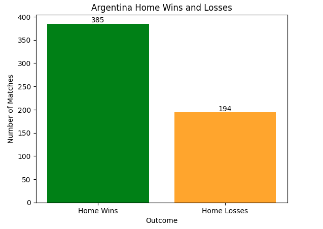
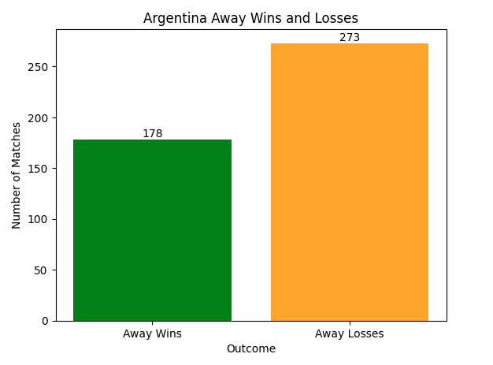
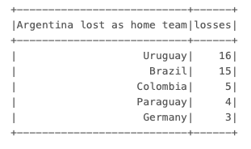
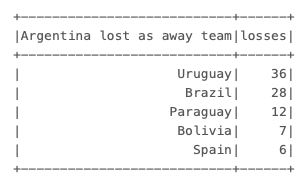

# ETL Pipeline in Databricks

In this project, I used historical international match results dating back to 1872 as my dataset.

## Demo Video 

## Key Components
* Extract:
  Dataset was first accessed from the Databricks dbfs and saved as delta table with the outlines schemas. 
  
* Transform:
  Empty columns were checked and new column called "winner" was added to the table. The column compares the goals scored by home verus away games. If away teams won, I mark it as "away", and if the home team won, I mark it as home. If tief, "tie". 
  
* Load:
  Next, only the Argentina games as home and away team are filtered and added as another delta table called "argentina_soccer". 

## ETL Auto Trigger

## Data Visualization 
Since the  1872, Argentina has won more games as a host rather than a visiting team. This makes me question how the traveling and the audience support affects game results as it seems Argentina team is more likely lose games where they are the away team. 

## Recommendation
Next, I wanted to see their toughest opponents. Argentina (as a host team) has lost to Uruguay and Brazil the most often than any other countries. 

When Argentina is the away team, they also lost to Uruguay and Brazil the most compared to rest of the international teams.

Based on these results, we can see that Argentinian national soccer team's toughest opponents are Uruguay and Brazil I recommend Argentinian team to study the game styles of these teams and analyze their performances. 

